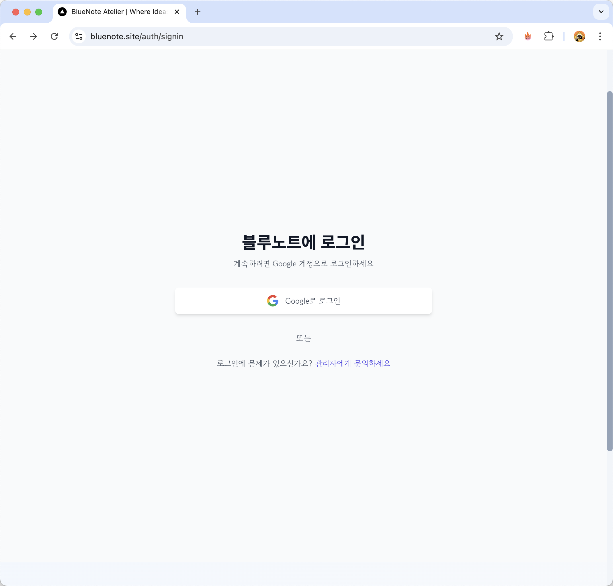
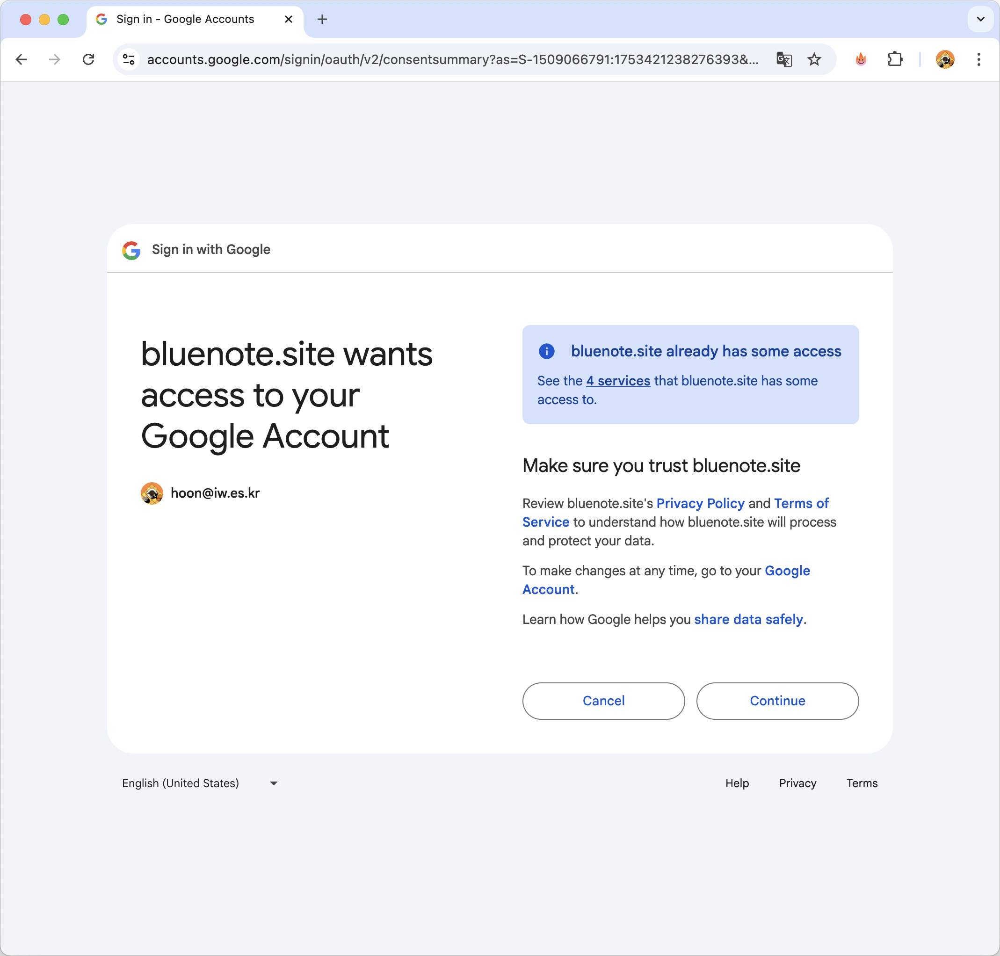
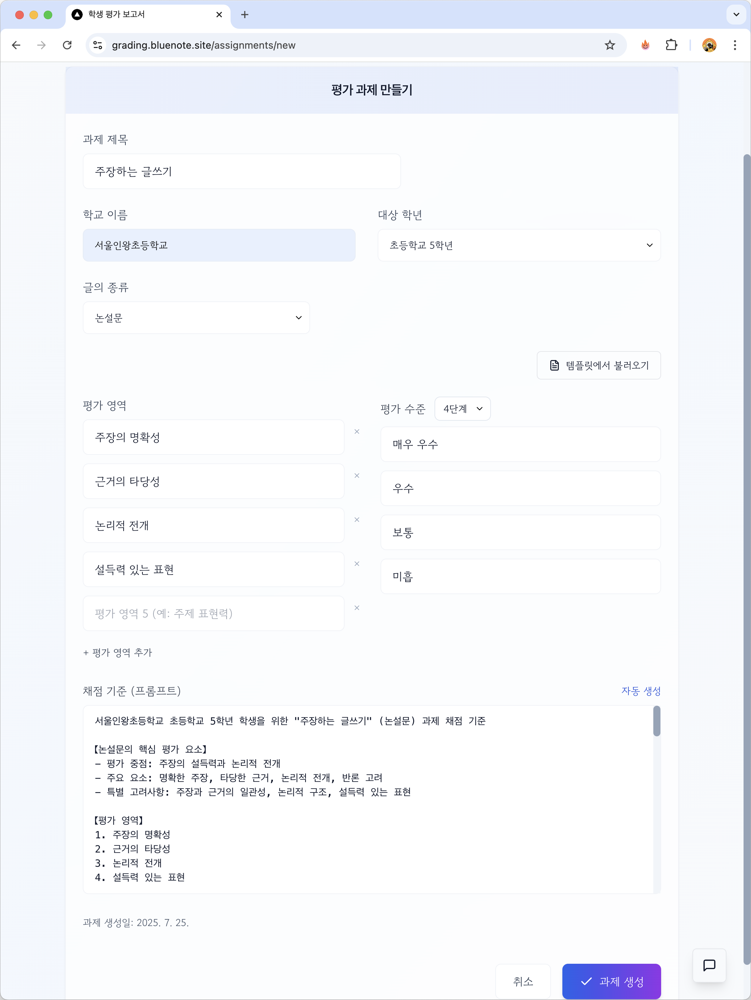
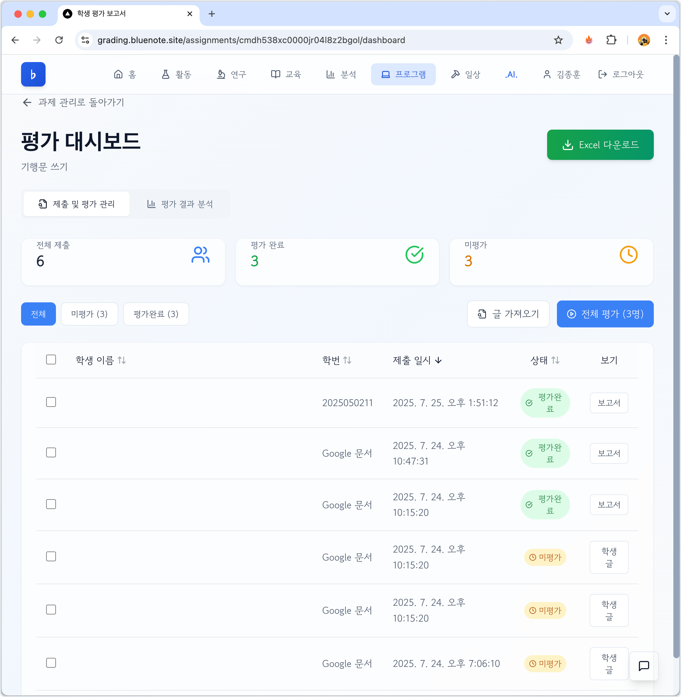
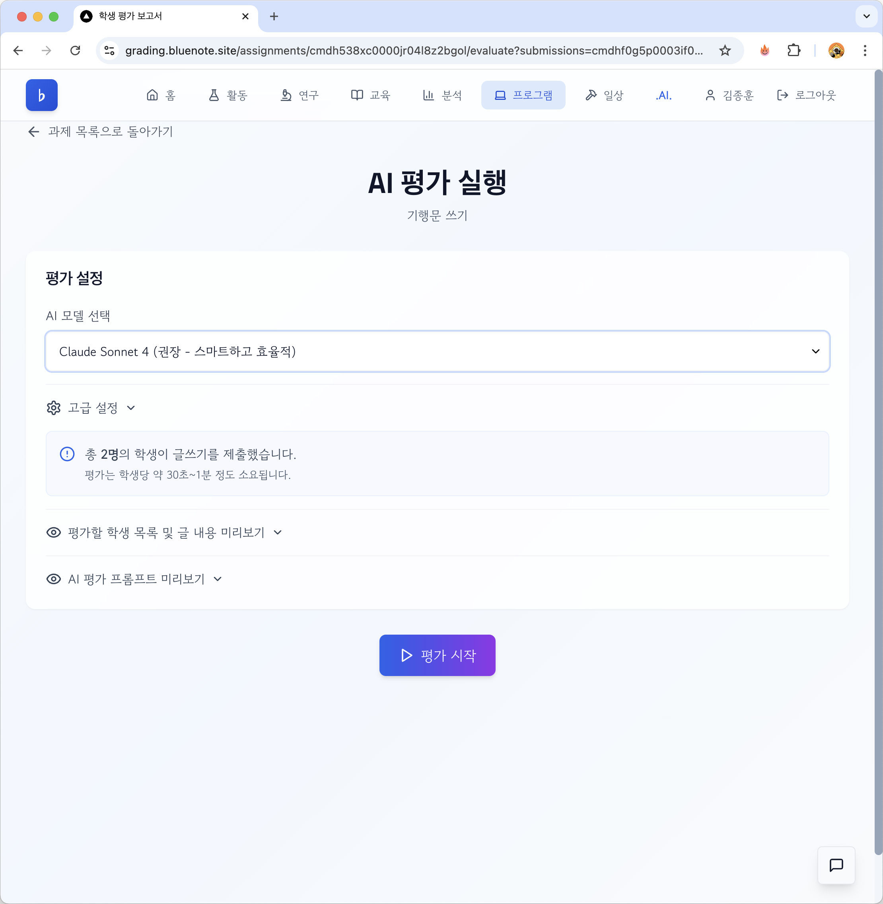
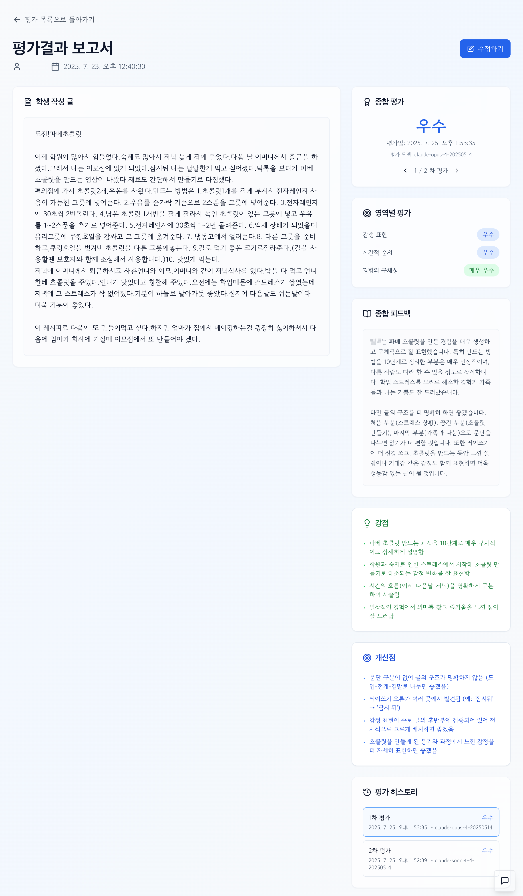

# AI 글쓰기 평가 시스템 사용 안내서

**[글쓰기 평가 시스템과 안내서는 교육과 연구를 위해 만들어졌습니다. 사용을 원하시면 hoon@iw.es.kr로 연락 주십시오.]**

## 목차
1. [시스템 소개](#1-시스템-소개)
2. [시작하기](#2-시작하기)
3. [과제 관리](#3-과제-관리)
4. [학생 글 수집](#4-학생-글-수집)
5. [AI 평가 실행](#5-ai-평가-실행)
6. [평가 결과 확인](#6-평가-결과-확인)
7. [데이터 내보내기](#7-데이터-내보내기)
8. [참고: 평가 결과](#8-참고-평가-결과)

---

## 1. 시스템 소개

### 1.1 주요 기능
AI 글쓰기 평가 시스템은 선생님들이 학생들의 글쓰기 과제를 효율적으로 평가하고 관리할 수 있도록 돕는 통합 플랫폼입니다.

- **AI 기반 자동 평가**: Claude AI를 활용한 정확하고 일관된 평가
- **맞춤형 평가 기준**: 과제별 루브릭 설정 가능
- **시각적 리포트**: 학생별 성장 단계 표시 및 상세 피드백
- **데이터 관리**: Excel, PDF 등 다양한 형식으로 내보내기

### 1.2 시스템 요구사항
- 최신 웹 브라우저 (Chrome, Safari, Edge 권장)
- 안정적인 인터넷 연결
- Google 계정 (로그인용)

---

## 2. 시작하기

### 2.1 시스템 접속

AI 글쓰기 평가 시스템은 **bluenote.site**에서 이용하실 수 있습니다.

  
  
[이미지: 01-bluenote.png - Bluenote 시스템 메인 화면]

1. 웹 브라우저를 열고 주소창에 **bluenote.site**를 입력합니다.
2. Enter 키를 눌러 사이트에 접속합니다.

> 💡 **팁**: 즐겨찾기에 추가하면 더 편리하게 이용할 수 있습니다.

### 2.2 로그인

1. bluenote.site에 접속하면 로그인 화면이 나타납니다.
2. 로그인 화면에서 **"Google로 로그인"** 버튼을 클릭합니다.

  
  
[이미지: 02-login-page.png - Google 로그인 버튼이 있는 로그인 페이지]

3. Google 계정으로 로그인합니다.

<table style="width: 50%; border-collapse: collapse;">
  <tr>
    <td style="width: 50%; padding: 5px;">
      
      
① 구글 계정 선택

    </td>
    <td style="width: 50%; padding: 5px;">
      
      
② 권한 요청 (Continue)

    </td>
  </tr>
  <tr>
    <td style="width: 50%; padding: 5px;">
      
      
③ Drive 접근 권한

    </td>
    <td style="width: 50%; padding: 5px;">
      
      
④ 최종 확인

    </td>
  </tr>
</table>

   * 구글의 인증 기능을 활용해 로그인합니다. 현재 연구용으로 사용가능한 상황입니다.
     구글 드라이브에서 학생 자료를 가져오게 하기 위해 여러 차례 "continue"를 선택해야 합니다.

4. 처음 로그인하는 경우, 관리자의 사전 승인이 필요합니다.

### 2.3 메인 대시보드

로그인 후 "프로그램" 네뉴를 선택하고, 글쓰기 평가 시스템을 선택합니다.

새 과제 만들기, 학생 글 가져오기, 평가 대시보드 등을 살펴보세요. 

평가 메인 대시보드로 이동하면 학생들의 글을 채점할 수 있습니다.

  
  
[이미지: 07-main-dashboard.png - 과제 목록이 카드 형태로 표시된 메인 화면]

**주요 구성 요소:**
- 상단 네비게이션 바
- 과제 카드 목록
- 새 과제 만들기 버튼

---

## 3. 과제 관리 및 수정하기

### 3.1 새 과제 만들기

1. 메인 대시보드에서 **"새 과제 만들기"** 버튼을 클릭합니다.
2. 과제 정보를 입력합니다:
3. 각 평가 영역에 대한 상세 기준을 설정한다.
💡 **팁**: 상세 프롬프트 자동 생성 기능 활용

  
  
[이미지: 08-create-assignment.png - 과제 생성 폼]

**입력 항목:**
- **과제명**: 예) "환경보호에 대한 설득적 글쓰기"
- **과제 설명**: 학생들에게 보여질 상세 안내
- **제출 기한**: 날짜와 시간 선택
- **평가 기준**: 3~5가지 기본 평가 영역 (수정 및 추가 삭제 가능)
  - 주장의 명확성
  - 근거의 타당성
  - 논리적 구조
  - 설득력 있는 표현

> 💡 **팁**: 명확한 평가 기준은 AI의 평가 정확도를 높입니다.

---

## 4. 학생 글 수집

### 4.1 제출 링크 공유

1. 과제 상세 페이지에서 **"제출 링크 복사"** 버튼을 클릭합니다.
2. 학생들에게 링크를 공유합니다.
> 💡 **팁**: QR 코드도 활용할 수 있습니다.

  
  
[이미지: 09-submission-link.png - 제출 링크가 표시된 화면]

### 4.2 제출 현황 확인

실시간으로 학생들의 제출 현황을 확인할 수 있습니다.

  
  
[이미지: 10-submission-status.png - 제출 현황 대시보드]

---

## 5. AI 평가 실행

### 5.1 평가 시작하기

1. 과제 페이지에서 **"AI 평가 시작"** 버튼을 클릭합니다.
2. 평가할 학생을 선택합니다 (전체 선택 가능).

  
  
[이미지: 11-start-evaluation.png - AI 평가 시작 화면]

### 5.2 평가 진행 상황

평가가 진행되는 동안 실시간으로 진행 상황을 확인할 수 있습니다.

  
  
[이미지: 12-evaluation-progress.png - 평가 진행 상황 표시 화면]

> ⚠️ **주의**: 평가 중에는 페이지를 닫지 마세요. 백그라운드에서 계속 진행됩니다.

---

## 6. 평가 결과 확인

### 6.1 전체 결과 대시보드

평가가 완료되면 전체 학생의 결과를 한눈에 볼 수 있습니다.

  
  
[이미지: 13-results-dashboard.png - 전체 평가 결과 대시보드]

**주요 기능:**
- 학생별 점수 및 등급 확인
- 영역별 성취도 분포
- 정렬 및 필터링 기능

### 6.2 개별 학생 리포트

각 학생의 상세 평가 결과를 확인할 수 있습니다.

  
  
[이미지: 14-individual-report.png - 학생 개별 평가 리포트]

**리포트 구성:**
- 성장 단계 시각화 (씨앗 → 새싹 → 꽃봉오리 → 꽃 → 열매)
- 영역별 상세 피드백
- AI가 생성한 종합 평가
- 교사 코멘트 추가 기능

---

## 7. 데이터 내보내기

### 7.1 Excel 내보내기

1. 결과 대시보드에서 **"Excel 내보내기"** 버튼을 클릭합니다.
2. 포함할 데이터 범위를 선택합니다.

  
  
[이미지: 15-export-excel.png - Excel 내보내기 옵션 화면]

### 7.2 PDF 리포트 생성 (예정)

개별 학생 리포트를 PDF로 저장할 수 있습니다.

### 7.3 일괄 다운로드 (예정)

여러 학생의 리포트를 한 번에 다운로드할 수 있습니다.

---

## 8. 평가 결과

### 8.1 AI 모델: Claude Sonnet 4 채점 사례
일상적인 사용에 최적화된 스마트하고 효율적인 모델.
권장이라고 한 까닭은 API 사용료 때문으로 일반적인 방식의 실험 과정은 Sonnet 모델로 진행하고자 함.

  
  
[이미지: 16-sonnet.png - Sonnet 4 채점 사례 화면]

### 8.2 AI 모델: Claude Opus 4  채점 사례
Anthropic의 가장 강력한 모델. 
채점후 평가 의견 작성시 글쓰기 능력이 Sonnet 보다 우수해서 학생들에게 제시하기에 적합한 모델.
아직 프롬프트에 따른 결과의 차이를 발견하기 위해 다양한 글과 평가 상황을 만들어 결과를 검토하는 중임.

  
  
[이미지: 17-opus.png - opus 4 채점 사례 화면]

### 8.3 주장하는 글을 기행문으로 채점한 결과
과제의 영역이 다른 글을 다른 채점 루브릭으로 채점을 하게 되었을 때의 결과. 
채점의 타당성 등을 검토할 수 있는 사례.

  
  
[이미지: 18-out.png - 글의 종류가 다른 경우 채점 사례 화면]

---

*최종 업데이트: 2025년 7월 25일*